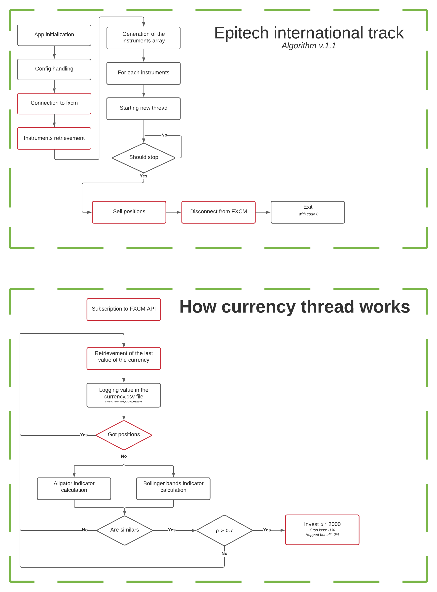

# Forex market trading robot

---
This bot is a fourth year eptiech project.
The goal of this project is to develop an algorithm able to trade on the forex market and win money automatically.
This tool should be totaly automated and doesn't require any interaction.

## Getting started
These instructions will help you to start to work with our tool in the best conditions
```
  git clone git@github.com/thmarinho/market-trading
  cd market-trading
  pip install -r requirement.txt
  python3 app.py
```
---
## Prerequisites
```
python3
pip
```
---
## Why python ?
```
We choose Python for for several reasons
First of all, Python is an easy to use language.
Moreover, this language is made for mathematics and, I wish you know, this project is largely made of mathematics.
And last but not least, a big part of this project is based on algorithm and python has a large choise of data processing library
```
---
## Algorithm


---
## Authors
* [Arthur Le Breton](arthut.le-breton@epitech.eu)
* [Théo Marinho](theo.marinho@epitech.eu)
* [Thomas Bocquez](thomas.bocquez@eptiech.eu)
